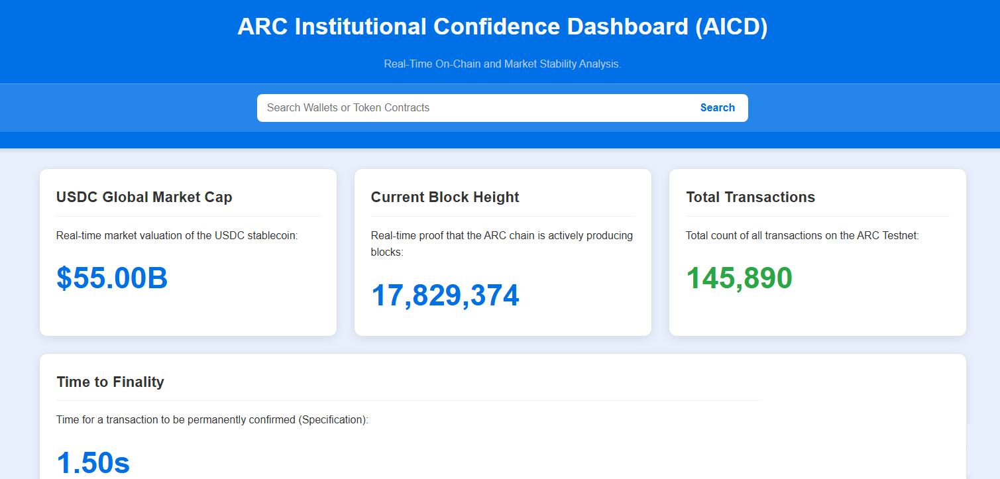

# ARC Institutional Confidence Dashboard (AICD) 🏛️

The **ARC Institutional Confidence Dashboard (AICD)** is a real-time risk analysis and monitoring tool designed to foster institutional-level transparency within the ARC Network. 

In a rapidly evolving ecosystem, AICD serves as a vital **"capital window"**, providing high-volume participants, developers, and investors with a clear, data-driven view of network stability and liquidity health.

---

## 🚀 Key Features

- **Real-Time Liquidity Monitoring:** Live tracking of USDC Global Market Cap and core liquidity pairs within the ARC Network.
- **Whale Watcher:** Advanced filtering of significant transactions (>$1,000) to monitor institutional capital movements.
- **Institutional Analytics:** Specialized metrics focused on network stability and risk assessment.
- **Agentic Commerce Ready:** Built to monitor transactions in the upcoming AI-driven economic landscape.
- **Responsive Design:** Fully optimized for desktop and mobile institutional monitoring.

## 🛠️ Tech Stack

- **Frontend:** HTML5, CSS3, JavaScript (Vanilla)
- **Deployment:** Vercel / GitHub Pages
- **Data Source:** ARC Network APIs (Mainnet integration in progress)

## 🗺️ Roadmap

- [x] Initial UI/UX Design & Dashboard Wireframe
- [x] Static Data Integration for PoC
- [ ] Live ARC API Integration (Current Stage)
- [ ] Advanced Risk Scoring Algorithm
- [ ] Exportable Institutional Reports (PDF/CSV)

## 👤 Author

**Raphael Marques Ribeiro Dos Santos**
- **LinkedIn:** https://www.linkedin.com/in/raphael-marques-ribeiro-dos-santos-92a892110/
- **Twitter/X:** [@RaphaelxMarques](https://x.com/RaphaelxMarques)
- **Portfolio:** [Vercel Live Demo](https://arc-confidence-dashboard-v2.vercel.app/)

---

*Built with high-velocity, AI-assisted development workflows for the ARC Ecosystem.*
